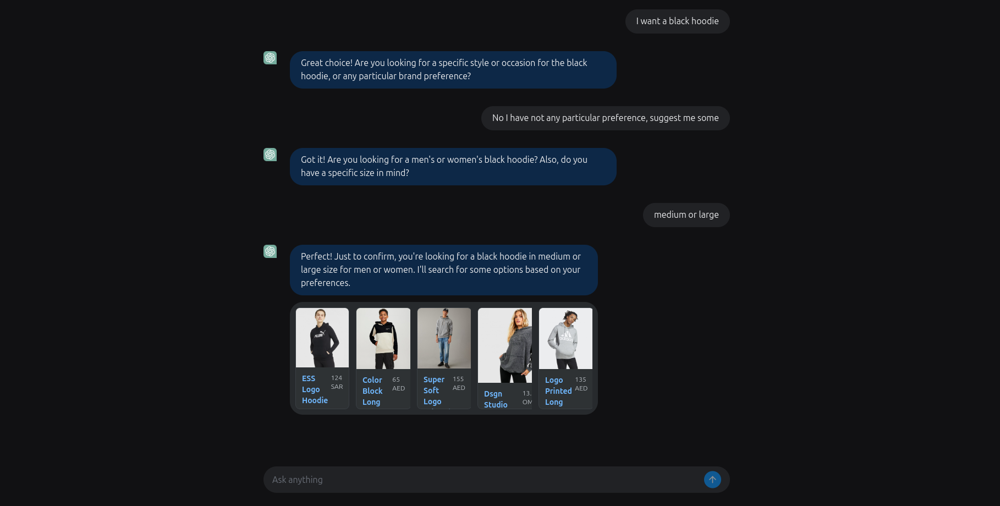

# Image Search Engine Frontend

This project is a frontend for a search engine, built using **Reflex**, a Python-to-JavaScript compiler framework. The application features a traditional search page and an AI-assisted page where users can interact with an AI to perform searches for them.

## Features
- **Traditional Search Page**: Allows users to describe the image and enter search queries.
- **AI-Assisted Search**: Enables conversational interaction where AI processes and performs searches based on user requests.
- **Responsive Design**: Optimized for both desktop and mobile views.

## Getting Started

### Prerequisites
Ensure you have **Python** installed and install **Reflex** by running:
```bash
pip install reflex
```

### Installation
Clone this repository and navigate to the project folder.

### Building the Project
To build the Reflex development server, use:
```bash
docker build -t reflex-app .
docker run -p 8080:8080 reflex-app
```

The application will be available locally. Reflex compiles Python to JavaScript, enabling interactive frontend components without additional JavaScript.

## Project Structure
- **/frontend**: Contains different pages for the app, including the search and AI-assist pages.
- **/frontend/components**: Houses reusable UI components.
- **/frontend/styles.py**: Custom styling for consistent theming.
- **/states**: The state variables of the webpage.

## Screenshots

---
 
---

This file serves as a guide for setting up and running the project, as well as for providing an overview of its main features and structure. For more on Reflex and its capabilities, refer to [Reflex documentation](https://reflex.dev).